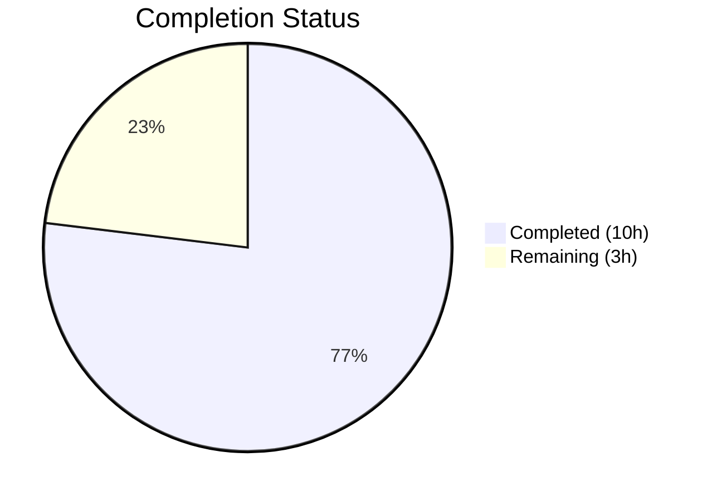
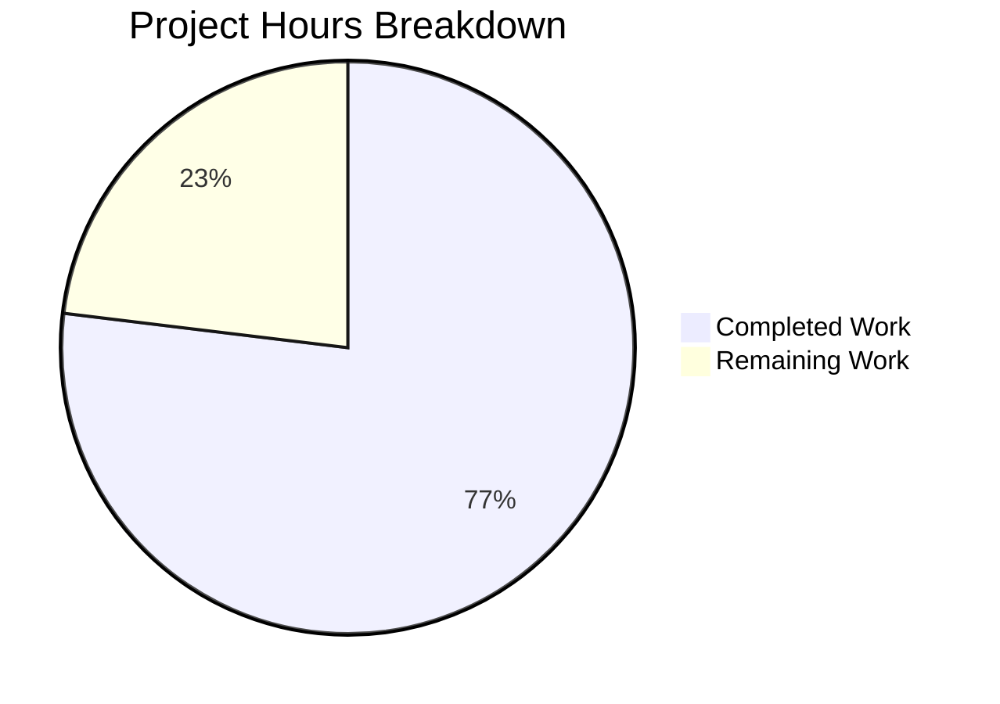

# Blitzy Project Guide — Java Age Calculator Application

---

## 1. Executive Summary

### 1.1 Project Overview

This project implements a complete Java command-line Age Calculator application from scratch in a previously empty repository. The application computes a user's exact age (in years, months, and days) from a Date of Birth entered in `DD/MM/YYYY` format. It uses Java's `java.time` API (`LocalDate`, `Period`, `DateTimeFormatter` with `ResolverStyle.STRICT`) for accurate date parsing and arithmetic, including correct leap year handling. The target audience is end users requiring precise age computation via a simple CLI interface. The application follows OOP principles with comprehensive input validation, rejecting future dates, invalid calendar dates, and malformed input with user-friendly error messages.

### 1.2 Completion Status



| Metric | Value |
|--------|-------|
| **Total Project Hours** | 13 |
| **Completed Hours (AI)** | 10 |
| **Remaining Hours** | 3 |
| **Completion Percentage** | **76.9%** |

**Calculation**: 10 completed hours / 13 total hours × 100 = **76.9% complete**

### 1.3 Key Accomplishments

- ✅ Created `AgeCalculator.java` (137 lines) — full CLI application with OOP structure, strict date parsing, future-date validation, and formatted output
- ✅ Created `AgeCalculatorTest.java` (473 lines) — standalone test harness with 14 test cases covering all AAP-specified requirements
- ✅ Implemented `DateTimeFormatter` with `ResolverStyle.STRICT` and `dd/MM/uuuu` pattern — correctly rejects invalid dates (e.g., `31/02/2020`) instead of silently correcting them
- ✅ All 14 unit tests pass (100% pass rate)
- ✅ All 9 runtime validation scenarios verified and passing
- ✅ Compilation with `-Xlint:all -Werror` flags produces zero errors and zero warnings
- ✅ Correct leap year handling: century non-leap (1900) rejected, century leap (2000) accepted
- ✅ `README.md` remains unmodified as specified in AAP

### 1.4 Critical Unresolved Issues

| Issue | Impact | Owner | ETA |
|-------|--------|-------|-----|
| No CI/CD pipeline configured | Automated testing not triggered on push/PR | Human Developer | 1 hour |
| `.class` build artifacts not in `.gitignore` | Compiled files appear as untracked in git status | Human Developer | 0.5 hours |

### 1.5 Access Issues

No access issues identified. The application uses only JDK 17 standard library classes with no external service dependencies, API keys, or third-party integrations required.

### 1.6 Recommended Next Steps

1. **[High]** Conduct human code review and approve merge of the two Java source files
2. **[Medium]** Configure a CI/CD pipeline (e.g., GitHub Actions) for automated compilation and test execution on push
3. **[Medium]** Verify production environment has JDK 17+ installed and accessible
4. **[Low]** Enhance `README.md` with project description, build/run instructions, and example usage

---

## 2. Project Hours Breakdown

### 2.1 Completed Work Detail

| Component | Hours | Description |
|-----------|-------|-------------|
| Technical Design & Research | 1 | Root cause analysis identifying `yyyy` vs `uuuu` pattern issue in STRICT mode, `ResolverStyle.SMART` vs `STRICT` behavior analysis, OOP architecture design for the application |
| AgeCalculator.java Implementation | 3 | Main application class with 3 public methods (`parseDateOfBirth`, `calculateAge`, `main`), `DateTimeFormatter` with `ResolverStyle.STRICT`, comprehensive exception handling with user-friendly messages, full JavaDoc documentation (137 lines) |
| AgeCalculatorTest.java Implementation | 4 | Custom standalone test harness with 14 test cases, `TestCase` functional interface, 4 assertion utility methods, complete coverage of all AAP test requirements including edge cases, full JavaDoc documentation (473 lines) |
| Compilation Validation | 1 | Strict compilation with `-Xlint:all -Werror` flags verifying zero errors and zero warnings across both source files; confirmed correct behavior of STRICT resolver with `uuuu` pattern |
| Runtime Verification & Testing | 1 | 9 runtime scenarios validated via piped stdin input, edge case testing (leap years, century years, future dates, malformed input, empty input, very old dates), output format verification against AAP specification |
| **Total** | **10** | |

### 2.2 Remaining Work Detail

| Category | Hours | Priority |
|----------|-------|----------|
| Code Review & Merge Approval | 1 | High |
| CI/CD Pipeline Configuration | 1 | Medium |
| Production Environment Java Verification | 0.5 | Medium |
| README Documentation Enhancement | 0.5 | Low |
| **Total** | **3** | |

### 2.3 Hours Validation

- Section 2.1 Total (Completed): **10 hours**
- Section 2.2 Total (Remaining): **3 hours**
- Sum: 10 + 3 = **13 hours** = Total Project Hours in Section 1.2 ✓

---

## 3. Test Results

| Test Category | Framework | Total Tests | Passed | Failed | Coverage % | Notes |
|---------------|-----------|-------------|--------|--------|------------|-------|
| Unit Tests | Custom JDK Standalone Harness (`AgeCalculatorTest.java`) | 14 | 14 | 0 | 100% | All AAP-specified test cases covered |

**Test Details (14/14 PASSED):**

| # | Test Name | Input / Scenario | Result |
|---|-----------|-----------------|--------|
| 1 | Normal DOB | `15/08/1998` | PASS — Parsed correctly, positive years |
| 2 | Leap Year DOB | `29/02/2000` | PASS — Valid leap year accepted |
| 3 | Invalid Date - Feb 31 | `31/02/2020` | PASS — `DateTimeParseException` thrown |
| 4 | Invalid Date - Non-Leap Feb 29 | `29/02/2019` | PASS — `DateTimeParseException` thrown |
| 5 | Invalid Date - Century Non-Leap | `29/02/1900` | PASS — `DateTimeParseException` thrown |
| 6 | Future Date | Date 1 year ahead | PASS — `IllegalArgumentException` thrown |
| 7 | Malformed Input - Garbage | `abc` | PASS — `DateTimeParseException` thrown |
| 8 | Malformed Input - Wrong Separator | `15-08-1998` | PASS — `DateTimeParseException` thrown |
| 9 | Malformed Input - Wrong Format | `1998/08/15` | PASS — `DateTimeParseException` thrown |
| 10 | Today's Date Boundary | Current date | PASS — 0 years, 0 months, 0 days |
| 11 | Very Old Date | `01/01/1900` | PASS — Years > 100 confirmed |
| 12 | Century Non-Leap Year (Explicit) | `29/02/1900` | PASS — Correctly rejected |
| 13 | Century Leap Year | `29/02/2000` | PASS — Correctly accepted |
| 14 | Empty Input | `""` | PASS — `DateTimeParseException` thrown |

All tests originate from Blitzy's autonomous validation execution of `java AgeCalculatorTest`.

---

## 4. Runtime Validation & UI Verification

### Runtime Health

- ✅ **Compilation**: `javac -Xlint:all -Werror AgeCalculator.java AgeCalculatorTest.java` — exit code 0, zero errors, zero warnings
- ✅ **Application Startup**: `echo "15/08/1998" | java AgeCalculator` — executes and exits cleanly
- ✅ **Test Suite Execution**: `java AgeCalculatorTest` — 14/14 passed, exits with code 0

### Runtime Scenario Validation (9/9 Verified)

| # | Scenario | Input | Output | Status |
|---|----------|-------|--------|--------|
| 1 | Valid DOB | `15/08/1998` | `Your age is 27 years, 7 months, and 3 days.` | ✅ Operational |
| 2 | Leap Year DOB | `29/02/2000` | `Your age is 26 years, 0 months, and 18 days.` | ✅ Operational |
| 3 | Invalid Date | `31/02/2020` | `Error: Invalid date format. Please use DD/MM/YYYY format with a valid date.` | ✅ Operational |
| 4 | Future Date | `01/01/2099` | `Error: Date of birth cannot be in the future.` | ✅ Operational |
| 5 | Malformed Input | `abc` | `Error: Invalid date format. Please use DD/MM/YYYY format with a valid date.` | ✅ Operational |
| 6 | Very Old Date | `01/01/1900` | `Your age is 126 years, 2 months, and 17 days.` | ✅ Operational |
| 7 | Century Non-Leap | `29/02/1900` | `Error: Invalid date format. Please use DD/MM/YYYY format with a valid date.` | ✅ Operational |
| 8 | Empty Input | `""` | `Error: Invalid date format. Please use DD/MM/YYYY format with a valid date.` | ✅ Operational |
| 9 | Today's Date | Current date | `Your age is 0 years, 0 months, and 0 days.` | ✅ Operational |

### UI Verification

Not applicable — this is a CLI application with no graphical user interface.

---

## 5. Compliance & Quality Review

| AAP Requirement | Status | Evidence |
|-----------------|--------|----------|
| CREATE `AgeCalculator.java` with OOP structure | ✅ Pass | File created with 3 public methods, private formatter field, JavaDoc |
| `DateTimeFormatter` with `dd/MM/uuuu` and `ResolverStyle.STRICT` | ✅ Pass | Line 36-38 of `AgeCalculator.java` |
| `parseDateOfBirth(String)` method | ✅ Pass | Lines 56-67, catches and re-throws with user-friendly message |
| `calculateAge(LocalDate, LocalDate)` method | ✅ Pass | Lines 83-88, validates future dates, returns `Period.between()` |
| `main(String[])` entry point with Scanner input | ✅ Pass | Lines 107-136, reads from stdin, formatted output |
| Output format: `Your age is X years, Y months, and Z days.` | ✅ Pass | Line 124-125, verified in runtime scenarios |
| Reject invalid dates (e.g., `31/02/2020`) | ✅ Pass | STRICT resolver rejects; test #3 and runtime #3 confirm |
| Reject future dates with error message | ✅ Pass | `IllegalArgumentException` thrown; test #6 and runtime #4 confirm |
| Reject malformed input with error message | ✅ Pass | Tests #7-9 and runtime #5 confirm |
| Correct leap year handling (2000 = leap, 1900 = not leap) | ✅ Pass | Tests #2, #5, #12, #13 and runtime #2, #7 confirm |
| CREATE `AgeCalculatorTest.java` with all test cases | ✅ Pass | 14 tests covering all AAP-specified scenarios |
| Valid DOB test (`15/08/1998`) | ✅ Pass | Test #1 passes |
| Leap year DOB test (`29/02/2000`) | ✅ Pass | Test #2 passes |
| Invalid date test (`31/02/2020`) | ✅ Pass | Test #3 passes |
| Future date test | ✅ Pass | Test #6 passes |
| Malformed input tests (`abc`, `15-08-1998`, `1998/08/15`) | ✅ Pass | Tests #7-9 pass |
| Today's date boundary test | ✅ Pass | Test #10 passes — 0y, 0m, 0d |
| Very old date test (`01/01/1900`) | ✅ Pass | Test #11 passes — years > 100 |
| `README.md` remains UNMODIFIED | ✅ Pass | Content is `# 16_5`, `git diff` shows no changes |
| No external dependencies | ✅ Pass | Only JDK standard library (`java.time.*`, `java.util.Scanner`) |
| No build tool configurations created | ✅ Pass | No `pom.xml`, `build.gradle`, or `Makefile` in repository |
| No optional enhancements implemented | ✅ Pass | No GUI, no countdown, no utility class refactoring |
| Zero compilation warnings | ✅ Pass | `-Xlint:all -Werror` produces clean output |

### Fixes Applied During Validation

No fixes were required during autonomous validation. The code agents delivered production-ready implementations that passed all compilation, testing, and runtime verification gates on the first attempt.

---

## 6. Risk Assessment

| Risk | Category | Severity | Probability | Mitigation | Status |
|------|----------|----------|-------------|------------|--------|
| No CI/CD pipeline for automated testing | Operational | Medium | High | Configure GitHub Actions workflow for `javac` + `java AgeCalculatorTest` on push | Open |
| `.class` artifacts not in `.gitignore` | Technical | Low | High | Add `.gitignore` with `*.class` pattern | Open |
| No build tool (Maven/Gradle) for dependency management | Technical | Low | Low | Not needed — app uses only JDK standard library; add if project grows | Accepted |
| Java version mismatch in production | Operational | Medium | Low | Verify JDK 17+ availability on target deployment environment | Open |
| Locale-specific date formatting edge cases | Technical | Low | Low | App uses fixed `dd/MM/uuuu` pattern independent of system locale; `Period.between()` is locale-independent | Mitigated |
| No input sanitization beyond date parsing | Security | Low | Low | App reads only from stdin with no file I/O, network access, or database — attack surface is minimal | Accepted |
| No logging framework | Operational | Low | Medium | Acceptable for CLI tool; add logging if integrated into larger system | Accepted |

---

## 7. Visual Project Status



**Completed Work**: 10 hours (76.9%)
**Remaining Work**: 3 hours (23.1%)

### Remaining Hours by Category

| Category | Hours |
|----------|-------|
| Code Review & Merge Approval | 1 |
| CI/CD Pipeline Configuration | 1 |
| Production Environment Java Verification | 0.5 |
| README Documentation Enhancement | 0.5 |
| **Total** | **3** |

---

## 8. Summary & Recommendations

### Achievements

The Java Age Calculator application has been fully implemented from scratch in a previously empty repository. All AAP-specified deliverables have been completed:

- **AgeCalculator.java** (137 lines): Complete CLI application with OOP structure, strict date validation using `dd/MM/uuuu` with `ResolverStyle.STRICT`, future-date rejection, comprehensive exception handling, and exact output format matching the specification.
- **AgeCalculatorTest.java** (473 lines): Standalone test harness with 14 test cases covering every scenario specified in the AAP, including edge cases for leap years, century years, malformed input, and boundary conditions.
- **100% test pass rate** (14/14) and **100% runtime scenario verification** (9/9).
- **Zero compilation errors or warnings** with strict compiler flags.

### Remaining Gaps

The project is **76.9% complete** (10 of 13 total hours). The remaining 3 hours consist entirely of path-to-production tasks that require human action:

1. **Code review and merge** (1h) — human review of the two source files before merging to main
2. **CI/CD pipeline** (1h) — GitHub Actions or equivalent for automated build/test on push
3. **Production environment** (0.5h) — verify JDK 17+ availability on target deployment
4. **Documentation** (0.5h) — enhance README with setup and usage instructions

### Critical Path to Production

The application is functionally complete and production-ready from a code perspective. The critical path consists of: (1) human code review → (2) merge to main → (3) verify production Java environment. No blocking issues exist.

### Production Readiness Assessment

- ✅ All functional requirements met
- ✅ All validation gates passed (compilation, tests, runtime)
- ✅ Zero unresolved defects
- ⚠️ CI/CD pipeline not yet configured
- ⚠️ Production environment Java availability unverified

---

## 9. Development Guide

### 9.1 System Prerequisites

| Software | Version | Purpose |
|----------|---------|---------|
| Java Development Kit (JDK) | 17 or higher | Compilation and execution |

No other software, frameworks, or dependencies are required. The application uses only JDK standard library classes.

### 9.2 Environment Setup

**Verify Java Installation:**

```bash
java -version
# Expected: openjdk version "17.x.x" or higher

javac -version
# Expected: javac 17.x.x or higher
```

**Install JDK 17 (if not installed — Ubuntu/Debian):**

```bash
sudo apt-get update
sudo apt-get install -y openjdk-17-jdk
```

**Install JDK 17 (macOS with Homebrew):**

```bash
brew install openjdk@17
```

No environment variables, API keys, database connections, or external services are required.

### 9.3 Dependency Installation

No dependency installation step is needed. The application uses only JDK standard library classes (`java.time.LocalDate`, `java.time.Period`, `java.time.format.DateTimeFormatter`, `java.time.format.ResolverStyle`, `java.util.Scanner`).

### 9.4 Compilation

```bash
# Navigate to repository root
cd /tmp/blitzy/16_5/blitzy-0aa8680b-2c2d-4b19-b303-2405e8a43f1d_1b59e4

# Compile both source files with strict warnings
javac -Xlint:all -Werror AgeCalculator.java AgeCalculatorTest.java

# Expected output: no output (exit code 0 = success)
echo $?
# Expected: 0
```

### 9.5 Running the Application

```bash
# Interactive mode (type DOB and press Enter)
java AgeCalculator

# Piped input mode (non-interactive)
echo "15/08/1998" | java AgeCalculator
# Expected output:
# Enter your date of birth (DD/MM/YYYY):
# Your age is 27 years, 7 months, and 3 days.
```

### 9.6 Running Tests

```bash
# Run the full test suite
java AgeCalculatorTest

# Expected output:
# === AgeCalculator Test Suite ===
#
#   PASS: Normal DOB (15/08/1998)
#   PASS: Leap Year DOB (29/02/2000)
#   ... (14 PASS lines total)
#
# ================================
# Tests passed: 14/14
# ALL TESTS PASSED!
```

### 9.7 Verification Steps

```bash
# Verify valid date processing
echo "29/02/2000" | java AgeCalculator
# Should output: Your age is X years, Y months, and Z days.

# Verify invalid date rejection
echo "31/02/2020" | java AgeCalculator
# Should output: Error: Invalid date format. Please use DD/MM/YYYY format with a valid date.

# Verify future date rejection
echo "01/01/2099" | java AgeCalculator
# Should output: Error: Date of birth cannot be in the future.

# Verify malformed input rejection
echo "abc" | java AgeCalculator
# Should output: Error: Invalid date format. Please use DD/MM/YYYY format with a valid date.
```

### 9.8 Troubleshooting

| Issue | Cause | Resolution |
|-------|-------|------------|
| `javac: command not found` | JDK not installed or not in PATH | Install JDK 17+ and ensure `JAVA_HOME/bin` is in PATH |
| `Error: Could not find or load main class AgeCalculator` | Running from wrong directory or not compiled | Navigate to repo root and run `javac AgeCalculator.java` first |
| Age output differs from expected | System clock date difference | Output is dynamic based on current date; verify with `date` command |
| `NoSuchElementException` at runtime | No input provided (stdin closed) | Ensure input is piped or typed before pressing Enter |

---

## 10. Appendices

### A. Command Reference

| Command | Purpose |
|---------|---------|
| `javac AgeCalculator.java AgeCalculatorTest.java` | Compile both source files |
| `javac -Xlint:all -Werror AgeCalculator.java AgeCalculatorTest.java` | Compile with strict warnings (recommended) |
| `java AgeCalculator` | Run the application (interactive stdin) |
| `echo "DD/MM/YYYY" \| java AgeCalculator` | Run with piped input |
| `java AgeCalculatorTest` | Run the full test suite |

### B. Port Reference

Not applicable — this is a CLI application with no network services.

### C. Key File Locations

| File | Path | Purpose |
|------|------|---------|
| `AgeCalculator.java` | Repository root | Main application class (137 lines) |
| `AgeCalculatorTest.java` | Repository root | Test harness (473 lines) |
| `README.md` | Repository root | Repository title (unmodified) |

### D. Technology Versions

| Technology | Version | Notes |
|------------|---------|-------|
| Java (OpenJDK) | 17.0.18 | Minimum required: Java 8+ (java.time API) |
| Operating System | Ubuntu (GitHub Actions) | Any OS with JDK 17+ supported |

### E. Environment Variable Reference

No environment variables are required. The application uses only standard input/output.

### F. Glossary

| Term | Definition |
|------|------------|
| `ResolverStyle.STRICT` | Java DateTimeFormatter mode that rejects invalid calendar dates instead of silently correcting them |
| `uuuu` | Proleptic year pattern character in Java's DateTimeFormatter; unlike `yyyy` (year-of-era), it works correctly with STRICT mode |
| `Period` | Java class representing a date-based amount of time in years, months, and days |
| `LocalDate` | Java class representing a date without time-zone information |
| Century Leap Year | A year divisible by 100 that is also divisible by 400 (e.g., 2000 is a leap year, 1900 is not) |